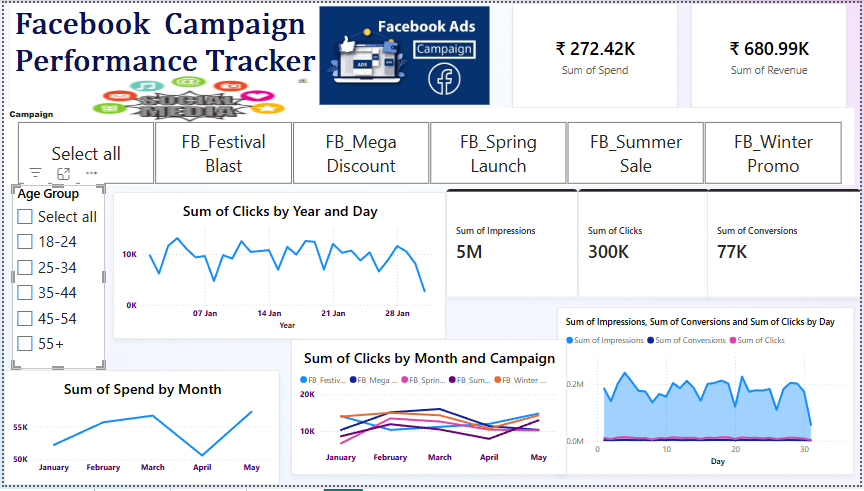
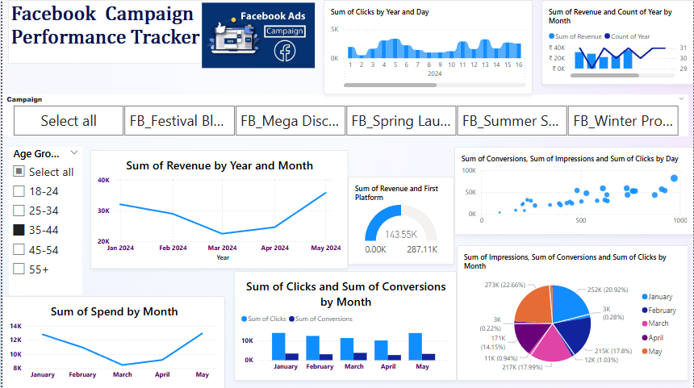
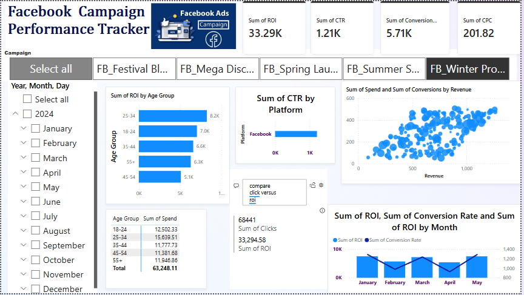

# FUTURE_DS_02
## 📊 Facebook Campaign Performance Tracker

🚀 A dynamic and interactive Power BI dashboard built to track, analyze, and visualize the performance of Facebook ad campaigns — as part of the **Data Science & Analytics Internship Task 2 by Future Interns**.

---

## 📌 Project Overview

This dashboard provides key marketing insights across various Facebook ad campaigns, helping stakeholders answer questions like:
- How well did each campaign perform?
- Which age group or demographic had the highest ROI?
- What trends are visible in clicks, conversions, and spend over time?

---

## 📁 Dataset

The dataset contains metrics exported from Facebook Ads Manager:
- Campaign Name
- Date
- Platform
- Gender
- Age Group
- Impressions
- Clicks
- Conversions
- Spend
- Revenue

---

## 📈 Key Metrics Tracked

- **CTR (Click-Through Rate)** = Clicks / Impressions  
- **CPC (Cost Per Click)** = Spend / Clicks  
- **Conversion Rate** = Conversions / Clicks  
- **ROI (Return on Investment)** = (Revenue - Spend) / Spend  
- **Revenue per Conversion** = Revenue / Conversions

---

## 🧰 Tools Used

| Tool         | Purpose                                  |
|--------------|-------------------------------------------|
| Power BI     | Dashboard creation & visualization       |
| Microsoft Excel | Data cleaning & formatting             |
| DAX          | Calculated measures (CTR, ROI, etc.)     |
| Canva (optional) | Custom banner & visuals              |

---

## 📊 Dashboard Features

- ✅ Overview KPIs (Total Spend, Revenue, CTR, ROI, CPC)
- 📆 Filters: Campaign, Age Group, Gender, Month
- 📉 Visuals: Line charts, bar charts, scatter plots, pie charts
- 🎯 Deep Dive: Age group analysis, revenue trends, CTR by platform

---

## 📷 Screenshots

### 📍 Page 1: Campaign Performance Overview

### 📍 Page 2: Monthly Trends & Revenue Breakdown

### 📍 Page 3: ROI & Conversion Efficiency

---

## 🎯 Insights & Recommendations

- Highest ROI observed in age group **35–44**
- Campaigns with higher impressions don’t always lead to higher conversions
- **CTR and ROI** vary significantly by age and month — optimization opportunity!

---

## 📚 Learnings

- Real-world application of marketing analytics
- Dashboard storytelling using Power BI
- Designing actionable KPIs for decision-making
- Creating calculated columns/measures using DAX

---

## 📌 Author

**Sakshi Srivastava**  
_Data & Analytics Enthusiast | Power BI Developer | Future Interns Participant_

🔗 [LinkedIn Profile](https://www.linkedin.com/in/sakshi-srivastava-59a3b3313/)

---

## 📢 License

This project is for educational and demonstration purposes only.  
© 2025 Sakshi Srivastava

